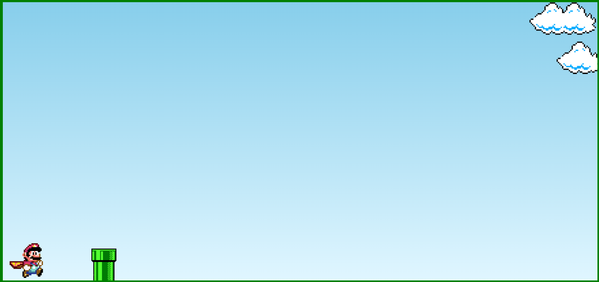

# 🍄 Super Mario Jump

---

## 🎮 Sobre o Jogo

Este projeto recria a mecânica clássica de pulo do Super Mario. O objetivo é simples: evitar os tubos e sobreviver o maior tempo possível!

A lógica do jogo foi construída inteiramente manipulando o **DOM**. Um loop (`setInterval`) verifica a cada **10ms** a posição do Mario e do Tubo para detectar colisões em tempo real.

### ✨ Funcionalidades

* 🏃 **Animação de Loop:** O cenário (tubos e nuvens) se move infinitamente para criar a ilusão de corrida.
* 💨 **Mecânica de Pulo:** Adição e remoção dinâmica de classes CSS para animar o sprite.
* 💥 **Detecção de Colisão:** Lógica matemática que verifica as coordenadas `bottom` (Mario) e `left` (Tubo) para disparar o "Game Over".
* ❌ **Game Over State:** Troca de sprites e parada de animações ao colidir.

---

## 📸 Preview

  

---
